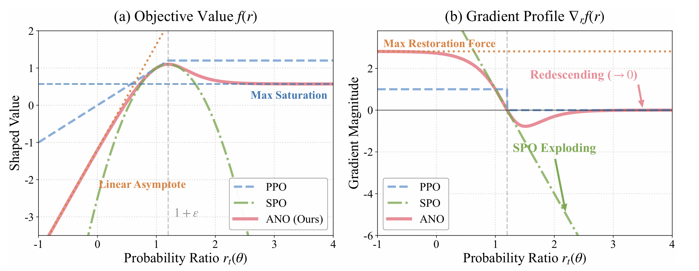
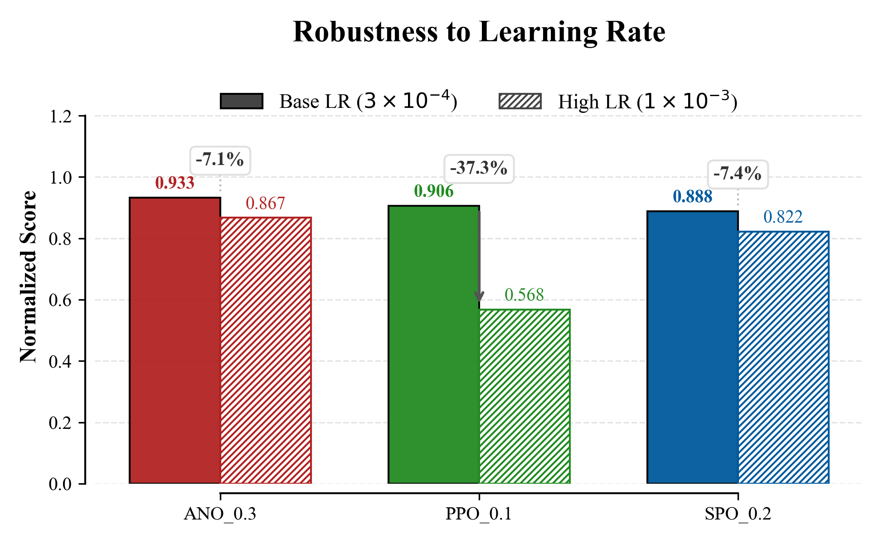
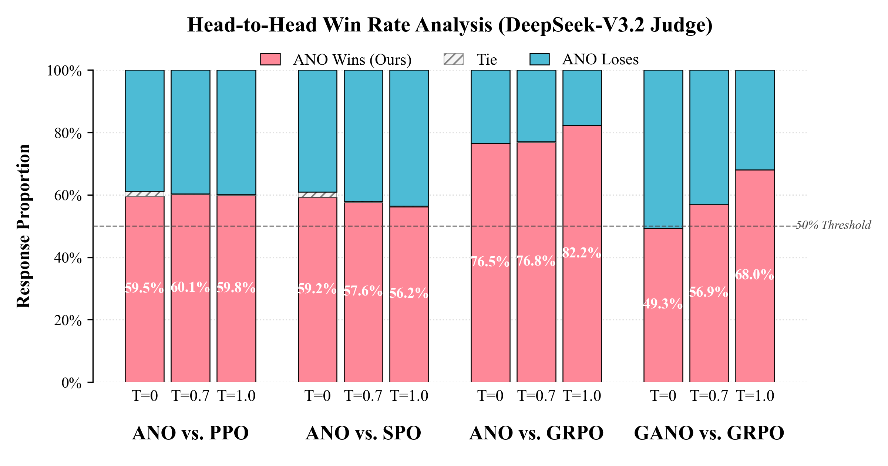

# ANO: A Principled Approach to Robust Policy Optimization

Official implementation of **ANO (Anchored Neighborhood Optimization)**.
> **Code Release:** This repository contains the reference implementation used in our experiments.

---

## 🔥 What is ANO?

**Proximal Policy Optimization (PPO)** is widely used but faces a fundamental dilemma:
- **Hard clipping** discards useful gradient information from outliers → hurts sample efficiency.
- **Removing clipping** can lead to unbounded gradients → instability and hyper-parameter sensitivity.

ANO resolves this via a Principled Design Space and a geometric shaping principle: **redescending influence** — suppress extreme outliers smoothly while keeping informative gradients in moderately-off-policy regions.  It is designed to be smooth, trust-region bounded, robust to outliers, and structurally parsimonious (requiring only one convexity change).

---

## ✅ Results at a Glance

| Shape Function | Robustness Analysis | Win Rate |
| :---: | :---: | :---: |
|  |  |  |

---

## 📦 Environment Setup

- Experimental coverage (as in paper): **LLM fine-tuning (RLHF)**.

**Tested with**
- OS: Ubuntu 20.04
- Python: 3.8+
- CUDA: optional (recommended for large-scale / LLM experiments)

### Clone & create Conda env

```bash
git clone <YOUR_REPO_URL>
cd ANO/

conda env create -f ano_trl.yml
conda activate ano_trl
````

---

## 🧪 Reproducing Experiments

See ANO/RLHF and ANO/Traditional_RL

## 📎 Citation

If you use this codebase, please cite:

```bibtex
@inproceedings{Anonymous2026ano,
  title     = {ANO: A Principled Approach to Robust Policy Optimization},
  author    = {Anonymous authors},
  booktitle = {},
  year      = {2026}
}
```

---

## 🙏 Acknowledgements

This repository builds upon and uses code from:

* **TRL** (Transformer Reinforcement Learning): [https://github.com/huggingface/trl](https://github.com/huggingface/trl)

Please refer to their licenses and cite them if you build upon their work.

