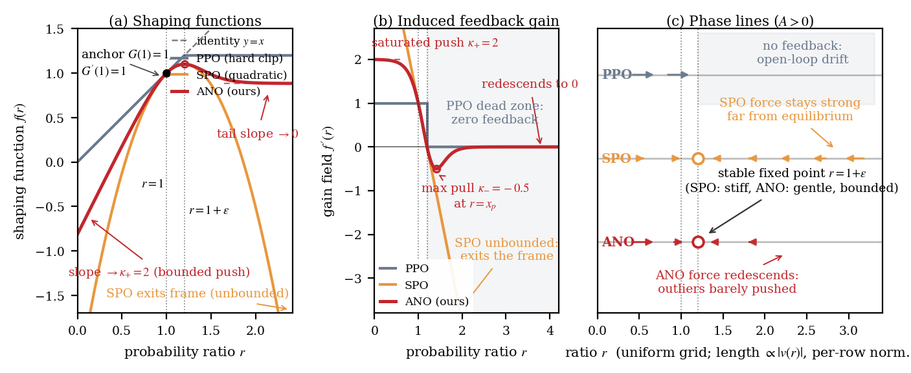

# ANO: Robust Policy Optimization via Bounded, Redescending Gain Fields

Official implementation of **ANO (Anchored Neighborhood Optimization)**.
> This repository contains the reference implementation used in our experiments. The paper is under double-blind review; code snapshot: https://anonymous.4open.science/r/ano-F818

---

## The Idea in Brief

Policy-gradient surrogate objectives are *feedback laws* on the probability ratio `r = π_new(a|s) / π_old(a|s)`: the derivative of the shaping function acts as a **gain field** that accelerates, brakes, or reverses the movement of `r`. Existing methods sit at two unstable extremes:

- **PPO (hard clip):** zero gain outside the trust region — a *dead zone* that leaves the policy drifting open-loop.
- **SPO (quadratic penalty):** a gain that grows linearly and without bound — the dynamics stiffen and destabilize under aggressive step sizes.

ANO designs the gain field directly. Its shaping kernel `G` is globally `C∞` and satisfies:

- **Anchoring:** `G(1) = 1`, `G'(1) = 1` (tangent to the identity map);
- **Sign reversal:** `G'(1 + ε) = 0` — the trust-region boundary is a stable fixed point of the ratio flow;
- **Bounded push:** `G'(-∞) = κ₊` — the force on severely off-policy samples saturates;
- **Bounded redescending pull:** `min G' = κ₋` — extreme outliers receive a bounded restoring force (in the spirit of redescending M-estimators);
- **Parsimony:** `G''` vanishes and changes sign exactly once.

The gain field is a difference of two logistic sigmoids:

```
G'(x) = κ₊ · ν · (1 − E) / [ (1 + E)(E + ν) ],   E = e^{a(x − x₀)},  x₀ = 1 + ε
```

<p align="center"></p>

*Geometry and induced dynamics of the surrogate objectives (display config ε = 0.2, κ₊ = 2, κ₋ = −0.5, same display config as the paper's Figure 1): **(a)** shaping functions — PPO kinks flat (hard clip), SPO is unbounded (quadratic), ANO is tangent to the identity at (1, 1) with a bounded-slope left tail (→ κ₊), a peak at 1 + ε, and a right tail flattening to slope 0; **(b)** induced feedback gain κ(r) = f′(r) — PPO's dead zone beyond 1 + ε, SPO's unbounded linear gain, ANO's bounded gain with saturated push κ₊, pull floor κ₋ at r = x_p, and redescendence to 0; **(c)** ratio-space phase lines for A > 0 — PPO's flow stalls at the boundary (open-loop drift), SPO's restoring force stays strong far from equilibrium, ANO's weakens past the stable fixed point 1 + ε. Generated from `ano/g_shaping.py` via `python assets/plot_kernel.py`.*

| Knob | Meaning | Paper default |
| :--- | :--- | :--- |
| `ε` | trust-region boundary (location of the stable fixed point) | swept in `{0.1, 0.2, 0.3}` |
| `κ₊` (`kappa_plus`) | cap on the push for severely off-policy samples | **10** |
| `κ₋` (`kappa_minus`) | floor of the gain field — bounded pull on outliers | **−1.5** |

All internal constants (`ν`, `a`, `x₀`) are recovered **in closed form** from `(ε, κ₊, κ₋)` before training; the training loop performs only element-wise arithmetic on the ratios (O(1) overhead per sample, same cost as PPO's clip). A point-symmetric dual `g(r) = 2 − G(2 − r)` handles the opposite tail, so the objective remains an exact instance of the paper's surrogate family.

---

## Main Results (see paper for full tables and confidence intervals)

- **Atari (40 ALE games)** and **MuJoCo (6 tasks)**, 5 seeds each, aggregated with `rliable`:
  ANO ranks **first on both domains in IQM and Median** of normalized scores. The runner-up is domain-dependent (PAPO on Atari, SPO on MuJoCo); no single baseline matches ANO on both.
- **Learning-rate stress test** (MuJoCo, `3e-4 → 1e-3`): ANO degrades by **0.9%**, SPO by 6.6%, PPO collapses by **54.5%**; the stressed ANO still outperforms PPO and PAPO at their best-tuned learning rates.
- **Dynamics diagnostics:** under matched `ε = 0.1`, PPO leaves **7.88%** of samples in the zero-gradient dead zone on average vs **1.21%** for ANO (6.5× smaller), confirming the bounded restoring force pulls ratios back inside the trust region.
- **LLM alignment** (Reddit TL;DR, Pythia-1B policy + reward model, 1M episodes, TRL): rated by an independent LLM judge (300 held-out prompts, 4-dimension 1–10 rubric, greedy decoding), ANO scores **7.58** vs PPO **6.76** and SPO **7.43**, with the lowest final KL to the SFT reference (39.5 vs 54.0) and the highest policy entropy. Raw judge outputs are in `RLHF/rubric_results/`.

---

## Repository Layout

```
Traditional_RL/   Atari (ALE v5, 40 games) and MuJoCo (v4, 6 tasks), single-file trainers
                  (PPO, TRPO, SPO, PAPO, ANO) in the CleanRL style
RLHF/             TRL fork with ANO / PPO / SPO / PAPO on-policy trainers
                  (experimental/ano, experimental/papo, experimental/spo, experimental/ppo)
                  plus the LLM-judge evaluation pipeline (judge.py, judge_rubric.py,
                  bash_judge_rubric.sh) and raw judge outputs (rubric_results/)
ano/              Reference implementation of the shaping kernel (numpy)
```

## Quick Start

### Traditional RL

```bash
git clone <YOUR_REPO_URL>
cd ANO/Traditional_RL
# see README.md there for the conda environment ("ano_rl")
bash bash_atari_ano.sh     # Atari, ANO  (PPO/SPO/TRPO variants included)
bash bash_mujoco_ano.sh    # MuJoCo, ANO
```

ANO hyperparameters (paper notation) map to CLI flags as follows:

```bash
python atari.py --algo ANO --epsilons 0.2 0.2 \
    --ano-kappa-plus 10 --ano-kappa-minus -1.5 --cuda True
```

`--epsilons` sets the trust-region boundary `ε` (first value used); `--ano-kappa-plus` / `--ano-kappa-minus` set `κ₊` / `κ₋` (defaults 10 / −1.5). Sweep `ε ∈ {0.1, 0.2, 0.3}` to reproduce the paper's configuration study.

### RLHF (TL;DR summarization)

```bash
cd ANO/RLHF
conda env create -f ano_trl.yaml && conda activate ano_trl
bash bash_ano.sh     # ANO   (bash_ppo.sh / bash_grpo.sh for baselines)
bash bash_judge_rubric.sh   # LLM-judge evaluation of the trained checkpoints
```

---

## Reproducibility Notes

- 5 independent seeds per configuration; aggregates (IQM, Median, Mean, Std) computed with [rliable](https://github.com/google-research/rliable) over per-environment normalized scores; a run's final score is the mean over its last 2% of training steps (evaluation-window sweeps are reported in the paper's appendix).
- Atari: Human Normalized Score with the reference scores of Mnih et al. (2015) and Vieillard et al. (2020) for ElevatorAction / Carnival / AirRaid; MuJoCo: Expert (TD3) Normalized Score. Training rewards are clipped (`sign`); evaluation uses raw returns. Atlantis episodes are capped at 27,000 steps.
- TRPO curves were re-run from scratch with this codebase; see the paper appendix for details.
- The RLHF judge is an external LLM accessed through an OpenAI-compatible API (endpoint and key are configured via environment variables; `OPENAI_API_KEY`).

## Citation

```bibtex
@inproceedings{Anonymous2027ano,
  title     = {ANO: Robust Policy Optimization via Bounded, Redescending Gain Fields},
  author    = {Anonymous authors},
  booktitle = {Under review at ICLR 2027},
  year      = {2027}
}
```

## Acknowledgements

This repository builds upon and uses code from:

* [TRL](https://github.com/huggingface/trl) (Transformer Reinforcement Learning)
* [CleanRL](https://github.com/vwxyzjn/cleanrl)
* [EnvPool](https://github.com/sail-sg/envpool), [Tianshou](https://github.com/thu-ml/tianshou), [rliable](https://github.com/google-research/rliable)

Please refer to their licenses and cite them if you build upon their work.
